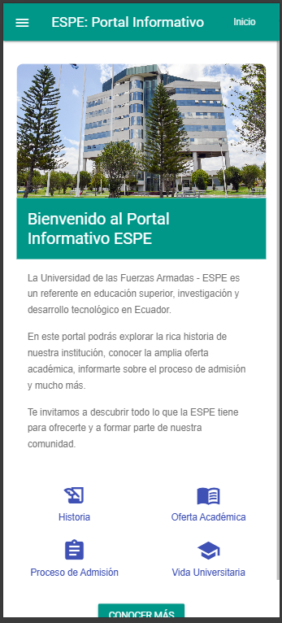
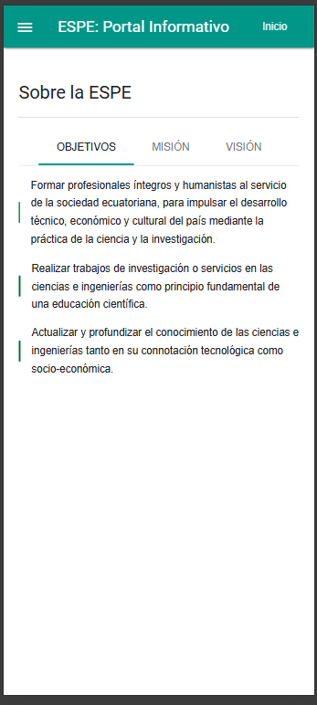
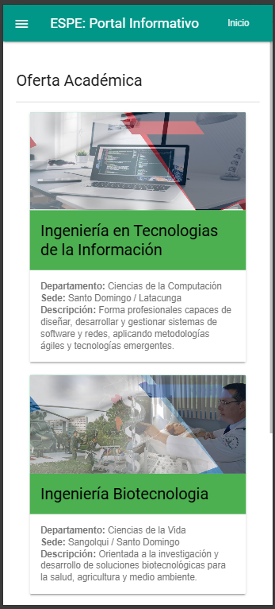

# ESPE PWA Portal

## Descripción

Aplicación web progresiva (PWA) que proporciona acceso a información sobre la Universidad de las Fuerzas Armadas ESPE, incluyendo historia, oferta académica, proceso de admisión y más.

## Características

- **Funcionalidad Offline**: Acceso a contenido incluso sin conexión a internet.
- **Notificaciones Push**: Recibe actualizaciones y noticias importantes.
- **Instalación en el Escritorio o Móvil**: Añade la aplicación a tu pantalla de inicio para un acceso rápido.

## Tecnologías Utilizadas

- HTML5
- CSS3 (Material Design Lite)
- JavaScript
- Service Workers
- Web Manifest

## Despliegue

La aplicación está desplegada en GitHub Pages y puede accederse en:

[https://alexmig24.github.io/ESPE_PWA_Portal/](https://alexmig24.github.io/ESPE_PWA_Portal/)

## Instrucciones para Clonar y Ejecutar Localmente

1. Clona el repositorio:

   ```bash
   git clone https://github.com/Alexmig24/ESPE_PWA_Portal.git
   cd ESPE_PWA_Portal
---

## Funcionalidades principales

- Navegación dinámica mediante fetch para cargar páginas internas sin recargar toda la app.
- Service Worker implementado con estrategia **Cache First** para garantizar funcionamiento offline.
- Cache de archivos estáticos, páginas HTML, imágenes, CSS y JS esenciales.
- Soporte para instalación como PWA (botón instalar).
- Notificaciones push configuradas (placeholder para ampliar).
- Diseño responsivo basado en Material Design Lite.
- Sección inicio enriquecida con imagen, texto, botones y grid de iconos representativos.
- Componentes visuales accesibles y amigables.

---

## Detalles técnicos

### Service Worker (`sw.js`)

- Cachea recursos estáticos en evento `install`.
- Limpia caches antiguas en evento `activate`.
- Intercepta peticiones `fetch` con estrategia cache-first:
  - Sirve recurso cacheado si existe.
  - Si no, descarga de red, cachea y devuelve.
  - Si falla la red y es documento HTML, sirve `index.html` cacheado.
- Filtra recursos para cache dinámico (CSS, JS, imágenes, fuentes Google, MDL).
- Maneja eventos `sync` y `push` para futura expansión.
- Gestiona clics en notificaciones push para abrir/focus app.

### Registro y uso en cliente (`app.js`)

- Registra el Service Worker en `load`.
- Solicita permiso de notificaciones.
- Gestiona evento `beforeinstallprompt` para mostrar banner de instalación.
- Maneja navegación dinámica al hacer clic en menú lateral.

### Diseño UI

- Página inicio (`inicio.html`) usa tarjeta MDL con:
  - Imagen representativa del campus.
  - Texto introductorio claro y dividido en párrafos.
  - Grid de iconos con dos columnas y dos filas (Historia, Oferta, Admisión, Vida Universitaria).
  - Botón “Conocer más” que carga sección “Sobre la ESPE”.
- Secciones como Misión, Visión y Objetivos presentan estilos diferenciados con sombra, rectángulos verticales y listas para mejor legibilidad.
- Uso combinado de CSS Grid y Flexbox para layout adaptable.

---

## Notas y recomendaciones

- Las rutas usan una variable `BASE_PATH` para soportar localhost y producción con prefijos distintos, ajusta según despliegue.
- La cache incluye archivos estáticos, páginas y recursos externos desde CDN para funcionalidad offline completa.
- Asegúrate de limpiar caches en DevTools al hacer actualizaciones para evitar servir contenido desactualizado.
- Puedes ampliar el manejo de eventos push y sincronización en segundo plano según necesidades.
- El diseño es responsive pero puede mejorarse para dispositivos muy pequeños o con funcionalidades adicionales (ejemplo: animaciones, loaders).
- El proyecto es un excelente ejemplo de PWA con arquitectura simple y buenas prácticas.

---
## Funcionamiento



